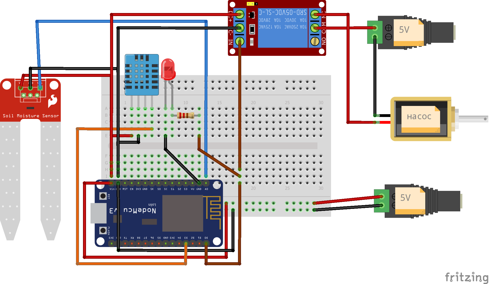

# Диплом

##  Разработка и внедрение системы орошения почвы на дачном участке для ухода за растениями в теплице с возможностью автоматического и ручного режимов полива. Удаленное управление системой орошения из любой точки мира.

Ссылка на диплом: https://github.com/ABCser/IoT-Diploma/blob/main/PDF/Diploma%20Mogilat.pdf

## Цели и задачи
Целью проекта является создание автономной системы, которая будет
регулировать уровень влажности почвы, оптимизируя полив растений в
теплице в соответствии с требуемыми условиями.

Задачи:
1. Изучить рынок необходимых для проекта электронных компонентов и
закупить их.
2. Написать код для реализации проекта.
3. Собрать устройство на основе микроконтроллера ESP8266.
4. Развернуть удаленный сервер для передачи и хранения информации с
устройства.
5. Протестировать и настроить устройство на стенде.
6. Запустить устройство в работу в реальных условиях для выявления и
устранения недоработок.
7. Убедиться, что работа устройства полностью соответствует целям и
проблематике проекта.

## Проделанная работа
1. Изучены необходимые инструменты и технологии для реализации проекта.
2. Выбраны и закуплены необходимые компоненты системы.
3. Спроектирована подробная схема работы устройства.
3. Собрано устройство на основе микроконтроллера ESP8266.
4. Развернут удаленный сервер для передачи и хранения информации с
устройства.
5. Система протестирована и настроена.

## Структура репозитория

Диплом  [https://github.com/ABCser/IoT-Diploma/](https://github.com/ABCser/IoT-Diploma/)

Приватная репа означает, что доступ к ней имеем только мы.

## Файлы репозитория

- [IMG](https://github.com/ABCser/IoT-Diploma/tree/main/IMG) - папка с видео и скриншотами 
- [README.md](https://github.com/ABCser/IoT-Diploma/blob/main/readme.md) - этот файл
- [Irrigator.ino](https://github.com/ABCser/IoT-Diploma/blob/main/Irrigator.ino) - код скетча для программирования системы
- [PDF](https://github.com/ABCser/IoT-Diploma/blob/main/PDF/Diploma%20Mogilat.pdf) - дипломная работа в формате PDF

## Описание 

Проект заключается в разработке и внедрении системы автоматического
и ручного увлажнения почвы на дачном участке для ухода за растениями,
находящимися в теплице, с возможностью удаленного управления системой
орошения из любой точки мира.
Проект основан на использовании микроконтроллера ESP8266, к
которому подключены датчики влажности почвы и температуры и влажности
воздуха DHT11. Эти датчики обеспечивают сбор данных, используемых для
автоматического управления реле водяной помпы для полива растений. Вся
собранная информация сохраняется и обрабатывается в базе данных InfluxDB,
развернутой на удаленном сервере.


## Код и принцип работы
### Исходный код
```cpp
#include <Arduino.h> // Библиотека для работы с Arduino
#include <DHT.h> // Библиотека для работы с DHT-сенсорами
#include <ESP8266WiFiMulti.h> // Библиотека для подключения к нескольким Wi-Fi сетям
#include <ESP8266WebServer.h> // Библиотека для работы с HTTP-сервером
#include <PubSubClient.h> // Библиотека для работы с MQTT

// Определения констант для устройства, Wi-Fi и MQTT
#define DEVICE "ESP8266" // Имя устройства
#define WIFI_SSID "SSID" // Имя Wi-Fi сети
#define WIFI_PASSWORD "pass" // Пароль Wi-Fi сети
#define DHTPIN D3 // Пин, к которому подключен DHT-сенсор

#define MQTT_SERVER "192.168.1.34" // IP-адрес MQTT сервера
#define MQTT_PORT 1883 // Порт MQTT сервера
#define MQTT_USER "user" // Имя пользователя MQTT
#define MQTT_PASSWORD "pass" // Пароль MQTT

// Инициализация DHT-сенсора, Wi-Fi и MQTT
DHT dht(DHTPIN, DHT11); // Создание экземпляра DHT-сенсора
ESP8266WiFiMulti wifiMulti; // Поддержка нескольких Wi-Fi сетей
ESP8266WebServer server(80); // HTTP сервер на порту 80
WiFiClient wifiClient; // Wi-Fi клиент для MQTT
PubSubClient mqttClient(wifiClient); // MQTT клиент с использованием Wi-Fi клиента

// Пины для подключения датчиков и управления насосом
const int moisturePin = A0; // Пин для считывания влажности почвы
const int waterPumpPin = D0; // Пин для управления насосом

// Переменные состояния
bool waterPumpOn = false; // Статус насоса (включен/выключен)
bool automaticMode = true; // Режим автоматического полива по умолчанию

// Интервалы для отправки данных и считывания с датчиков
const unsigned long interval = 10000; // Интервал отправки данных в MQTT (10 секунд)
const unsigned long interval1 = 1000; // Интервал считывания данных (1 секунда)

// Переменные для хранения значений датчиков
float m = 0; // Влажность почвы
float h = 0; // Влажность воздуха
float t = 0; // Температура воздуха

// Время последнего выполнения
unsigned long previousMillis = 0; // Время последней отправки данных
unsigned long previousMillis1 = 0; // Время последнего считывания влажности

// Функция для подключения к MQTT broker
void connectMQTT() {
    while (!mqttClient.connected()) { // Пока не подключен
        Serial.print("Connecting to MQTT..."); // Сообщение о попытках подключения
        // Подключение с использованием имени устройства и учетных данных
        if (mqttClient.connect(DEVICE, MQTT_USER, MQTT_PASSWORD)) {
            Serial.println("connected"); // Успешное подключение
        } else {
            Serial.print("failed, rc="); // Ошибка подключения
            Serial.print(mqttClient.state()); // Код ошибки
            delay(2000); // Задержка перед следующей попыткой
        }
    }
}

// Инициализация модулей и создание HTTP сервера
void setup() {
    Serial.begin(115200); // Инициализация последовательного порта
    pinMode(waterPumpPin, OUTPUT); // Установка режима пина насоса на вывод
    digitalWrite(waterPumpPin, HIGH); // Начальное состояние насоса - ВЫКЛ (HIGH - ВЫКЛ, LOW - ВКЛ)
    dht.begin(); // Инициализация DHT-сенсора
    WiFi.mode(WIFI_STA); // Установка режима Wi-Fi в режим клиент
    wifiMulti.addAP(WIFI_SSID, WIFI_PASSWORD); // Добавление сети Wi-Fi

    // Подключение к Wi-Fi
    Serial.print("Connecting to WiFi");
    while (wifiMulti.run() != WL_CONNECTED) { // Ожидание подключения
        Serial.print("."); // Программный индикатор подключения
        delay(500); // Задержка между попытками
    }
    Serial.println("\nWiFi connected"); // Вывод сообщения о подключении

    // Настройка MQTT
    mqttClient.setServer(MQTT_SERVER, MQTT_PORT); // Задание MQTT сервера и порта

    // Установка обработчиков HTTP запросов
    server.on("/", HTTP_GET, handleRoot); // Обработка GET-запросов на корневой странице
    server.on("/toggle-pump", HTTP_POST, []() { // Обработка POST-запроса для переключения насоса
        waterPumpOn = !waterPumpOn; // Переключение состояния насоса
        digitalWrite(waterPumpPin, waterPumpOn ? LOW : HIGH); // Действие насоса в зависимости от состояния
        server.sendHeader("Location", "/"); // Перенаправление обратно на главную страницу
        server.send(303); // HTTP код перенаправления
    });

    server.on("/toggle-mode", HTTP_POST, []() { // Обработка POST-запроса для переключения режима
        toggleMode(); // Переключение режима полива
        server.sendHeader("Location", "/"); // Перенаправление обратно на главную страницу
        server.send(303); // HTTP код перенаправления
    });

    server.begin(); // Запуск HTTP сервера
    Serial.println("HTTP server started"); // Сообщение о запуске сервера
}

// Функция для отправки данных в MQTT
void sendMQTT() {
    // Отправляем значения сенсоров через MQTT 
    mqttClient.publish("sensor/temperature", String(t, 2).c_str()); // Температура
    mqttClient.publish("sensor/humidity", String(h, 2).c_str()); // Влажность воздуха
    mqttClient.publish("sensor/moisture", String(m, 2).c_str()); // Влажность почвы

    // Отладочная информация в Serial
    Serial.print("Sent to MQTT: "); // Начало сообщения
    Serial.print("Temperature: "); // Температура
    Serial.print(t, 2);
    Serial.print(", Humidity: "); // Влажность
    Serial.print(h, 2);
    Serial.print(", Moisture: "); // Влажность почвы
    Serial.println(m, 2);
}

// Обработка HTTP запроса на корневой странице
void handleRoot() {
    String page = "<html lang='ru'><head><meta charset='UTF-8'><style>button{padding:10px 20px;font-size:16px;}</style></head><body>";
    page += "<h1>Система автоматического полива (beta)</h1>";
    page += "<p>Температура воздуха: " + String(t) + " C</p>"; // Отображение температуры
    page += "<p>Влажность воздуха: " + String(h) + "%</p>"; // Отображение влажности воздуха
    page += "<p>Влажность почвы: " + String(m) + "%</p>"; // Отображение влажности почвы
    page += "<form action='/toggle-pump' method='post'>"; // Форма для переключения насоса
    page += "<button type='submit' style='background-color:#4CAF50;color:white;padding:10px 20px;font-size:16px;border:none;cursor:pointer;'>";
    // Кнопка переключения насоса с изменением текста
    page += waterPumpOn ? "Выключить полив" : "Включить полив"; 
    page += "</button>";
    page += "</form>";

    page += "<form action='/toggle-mode' method='post'>"; // Форма для переключения режима
    page += "<button type='submit' style='background-color:#f44336;color:white;padding:10px 20px;font-size:16px;border:none;cursor:pointer;'>";
    // Кнопка переключения режима с изменением текста
    page += automaticMode ? "Ручной режим" : "Автоматический режим"; 
    page += "</button>";
    page += "</form>";

    page += "</body></html>";

    server.send(200, "text/html", page); // Отправка HTML страницы клиенту
}

// Переключение между ручным и автоматическим режимами управления насосом
void toggleMode() {
    automaticMode = !automaticMode; // Переключение режима
    if (!automaticMode) {
        digitalWrite(waterPumpPin, HIGH); // Выключить насос при ручном режиме
    }
    handleRoot(); // Обновление корневой страницы
}

// Основной цикл выполнения программы
void loop() {
    unsigned long currentMillis = millis(); // Получение текущего времени
    server.handleClient(); // Обработка входящих HTTP-запросов

    // Установите соединение с MQTT, если оно разорвано
    if (!mqttClient.connected()) {
        connectMQTT(); // Подключение к MQTT
    }
    mqttClient.loop(); // Обработка входящих сообщений MQTT

    // Чтение данных с датчиков
    h = dht.readHumidity(); // Считывание влажности воздуха
    t = dht.readTemperature(); // Считывание температуры воздуха
    m = 100.00 - ((analogRead(moisturePin) / 1023.00) * 100.00); // Считывание влажности почвы

    // Отладочная информация о влажности почвы
    if ((unsigned long)(currentMillis - previousMillis1) >= interval1) {
        Serial.print("Soil Moisture: "); // Ввод данных о влажности почвы
        Serial.print(m);
        Serial.println("%");
        previousMillis1 = millis(); // Обновление времени последнего считывания
    }

    // Автоматическое управление насосом
    if (automaticMode) {
        if (m < 50) {
            digitalWrite(waterPumpPin, LOW); // Включить насос, если влажность почвы низкая
        } else if (m >= 50 && m < 55) {
            digitalWrite(waterPumpPin, LOW); // Поддержание работы насоса в границах
        } else {
            digitalWrite(waterPumpPin, HIGH); // Выключить насос, если влажность достаточная
        }
    }

    // Отправка данных в MQTT по истечении интервала
    if ((currentMillis - previousMillis) >= interval) {
        sendMQTT(); // Вызов функции отправки данных в MQTT
        previousMillis = millis(); // Обновление времени последней отправки
    }
}
```

### Архитектура


### Схема подключеня


### Изображения готовой сборки
  

### InfluxDB, Grafana, Node-RED
   

### HTTP сервер


## Демонстрация работы системы (Видео кликабельно)
[](https://www.youtube.com/embed/B6TeFgF0p2M?feature=oembed)
